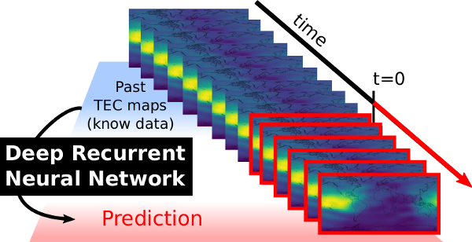

# TEC prediction using convolutional recurrent neural networks



## Reference

When using this code, cite the related paper:

**Ionospheric activity prediction using convolutional recurrent neural networks** by *Boulch Alexandre and Cherrier Noelie and Castaings Thibaut*

Please note that, the actual citation refers to a pre-print. The submission is under review at IEEE Transaction on Big Data. If the paper is accepted, please update your citation.


## Project

This work is part the [DELTA research project](https://delta-onera.github.io) at [ONERA, *The French Aerospace Lab*](https://www.onera.fr/en). Among its objectives are the development and the promotion of innovative machine learning based approaches for aerospace applications.

## TEC prediction

### Get the data

The data used for training and testing can retreived at:

[ftp://igs.ensg.ign.fr/pub/igs/products/ionosphere/](ftp://igs.ensg.ign.fr/pub/igs/products/ionosphere/)

### Convert the data to Numpy

The file ```convert_raw_to_numpy.py``` provides utility functions to convert the previously downloaded TEC maps to numpy format.

In order to use it:
* Fill the ```root_dir``` with the path to the data directory
* Fill the ```dest_dir``` with the path where to put the processed data
* ```imsize``` is the image size, ```(72, 72)``` is default values
* ```apply_compensation``` apply Earth rotation compensation

### Main file

#### Arguments

* ```seqLength```: length of the total sequence (input + prediction)
* ```seqStart```: length of the input sequence
* ```batchSize```: batch size
* ```cuda```: use cuda backend
* ```visdom```: use visdom for visualization
* ```test```: use network in test mode (training otherwise)
* ```skipPrediction```: do not predict (only compute scores)
* ```model```: which model to use (simple, unet, dilation121)
* ```diff```: use residual prediction
* ```extend```: use an extension of the image (to be DEPRECATED)
* ```target```: directory to save the results
* ```source```: directory containing the data
* ```recurrentUnit```: which recurrent unit to use (LSTM, GRU)

### Train a model

### Test

## License

The license is a dual license. For academic research, the code is released with LGPLv3 license. For commercial purpose, please contact the authors or ONERA.
See the [license](LICENSE.md).